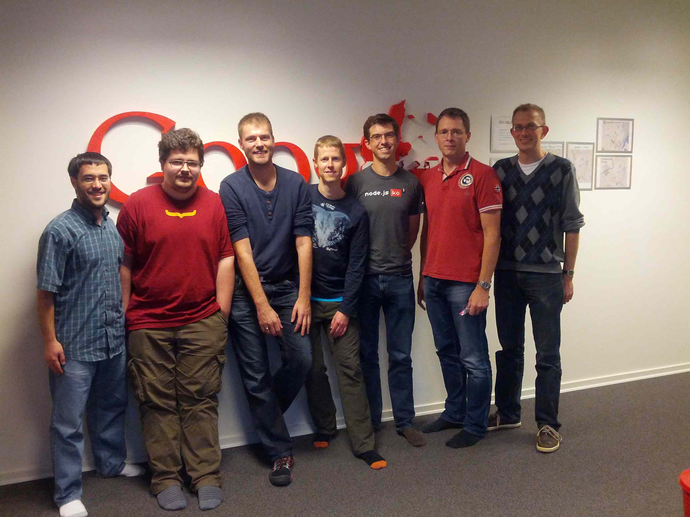

I recently returned from a systems software double-header, presenting at two of the industry's best conferences: [Surge](http://omniti.com/surge/2012) in Baltimore and [GOTO](http://gotocon.com/aarhus-2012/) in Aarhus, Denmark. These conferences have much in common: they are both expertly run; they both seek out top technical content; they both attract top technologists; and (it must be said) they both take excellent care of their speakers!

At Surge, I presented with [Brendan Gregg](http://dtrace.org/blogs/brendan/) on DIRT in production. This was a dense presentation, but it was fun for us to recount a sampling of the kinds of issues that we have seen in the new breed latency-sensitive data-intensive application. I think Brendan and I both agreed that this presentation could have easily been two or three times the length; we have plenty of scars from finding latency outliers in DIRTy systems! Beyond presenting, the lightning talks were a highlight for me at this year's Surge. I am an inveterate disaster porn addict, so it should come as no surprise that I particularly enjoyed [Chris Burroughs](https://twitter.com/csby54)' retelling of how his day that he had set aside to prepare his lightning talk was beset by disaster (including a PDU failure at the moment that it seemed things couldn't get any worse), and then [Scott Sanders](https://twitter.com/scott_sanders) on the surprisingly nasty failure modes that one can see in a mobile app when the root-cause is a botched datacenter upgrade in your mobile provider. For [my own lightning talk](http://www.youtube.com/watch?v=Rk8aZv0JJuk&feature=player_detailpage#t=3493s), I dug into the perverse history of what may well be the most obscure two-letter Unix command: the ["old and rarely used"](http://illumos.org/man/1/troff) [ta](https://github.com/illumos/illumos-gate/blob/master/usr/src/cmd/troff/troff.d/ta.c); hopefully others enjoyed learning about the history of this odd little wart as much as I did!

**Update**: This lightning talk is now online and can be viewed [here](http://www.youtube.com/watch?v=Rk8aZv0JJuk&feature=player_detailpage#t=3493s).

  
Dave and me with Lars Bak, Kasper Lund and the Dart (né V8) team

After Surge, [Dave](http://dtrace.org/blogs/dap) and I headed east, to Denmark. There, we presented on [dynamic languages in production](http://www.slideshare.net/bcantrill/goto2012). Our purposes for going to Aarhus were more than just GOTO, however: we also went to meet with [Lars Bak](http://en.wikipedia.org/wiki/Lars_Bak_(computer_programmer)), [Kasper Lund](https://plus.google.com/100258330325630692559/posts), [Erik Corry](https://twitter.com/erikcorry), [the inimitable Mr. Aleph](http://mrale.ph/) and the other engineers behind [V8](http://en.wikipedia.org/wiki/V8_(JavaScript_engine)). As the birthplace of V8, Aarhus has always had a Dagobah-like appeal to me: I feel that when on the freezing ice planet that is [mdb_v8.c](https://github.com/joyent/illumos-joyent/blob/master/usr/src/cmd/mdb/common/modules/v8/mdb_v8.c), Dave and I might as well have seen Obi-Wan Kenobi as an apparition, telling us we must go to Aarhus if we wanted to truly understand [objects-inl.h](v8%5C.googlecode%5C.com&ct=rc&cd=1&sq=). Dave and I immensely enjoyed our time with Lars and his team; it is rare to be in the presence of a team that has single-handedly changed the trajectory of software -- and it is rarer still to be able bring one's own technology to such an august table. We were thrilled to be able to demonstrate the confluence of our technology (specifically, MDB and DTrace) with theirs -- and to brainstorm ways that we might better solve the abstract problem of production debuggability of dynamic environments. This is a problem that we've been after in one way or another for nearly a decade, but this was the first time that we were having the conversation early enough in the VM implementation phase (specifically, of Dart) that one can hope to get ahead of the problem instead of chasing it. In particular, Lars's team has a very interesting idea for debuggability of Dart that -- if successful -- may allow it to achieve our nirvana of total postmortem debuggability in a dynamic environment. That, coupled with its enlightened (C-based!) native interface, left Dave and me optimistic about the long-term prospects of Dart on the server side. It's obviously early days still for Dart, but given the pedigree and talent of the team and their disposition towards making it both highly performing and highly debuggable, it's clearly something to pay attention to on the server side.

Presentation and meeting accomplished, I still had a burning question: what was all of this terrific VM talent doing in the second city of a small country with an excruciatingly difficult language to pronounce? (Aside: ask a Dane to say ["dead red red-eyed rotten smoked trout" in Danish](http://www.youtube.com/watch?v=_XwGcxNl8jc#t=5m22s).) In talking to Lars, Kasper and Erik about how they ended up in Aarhus a common theme emerged: all had -- in one way or another -- been drawn to work with [Professor Ole Lehrmann Madsen](http://users-cs.au.dk/olm/index.html/) on the VM for the [BETA language](http://cs.au.dk/~beta/). (No, I hadn't heard of BETA either, and yes, it's in all caps -- the name is apparently meant to be screamed.) Everyone I spoke with had such fond memories of BETA ("you know, it was actually a very interesting system...") that I have taken to calling this school of VM engineers the BETA School. The work and influence of the engineers of the BETA School extend beyond Google, with its members having done foundational VM work at VMware, Sun and a slew of startups.

I suppose I shouldn't be surprised that this cluster of engineers has a professor and a university at its root; Brown's [Tom Doeppner](http://www.cs.brown.edu/~twd/) has served a similar role for us, with his [CS169 giving rise to an entire generation of OS innovation](http://dtrace.org/blogs/bmc/2007/05/06/the-inculcation-of-systems-thinking/). The two schools of engineers share much in common: both are highly technical and close-knit -- but with a history of being open to newcomers and an emphasis on developing their junior members. (Of course, the difference is that we of the CS169 School don't all live in Providence.) And the intersection of the two schools is particularly interesting: [VMware's seminal ASPLOS paper](http://www.vmware.com/pdf/asplos235_adams.pdf) is a joint product of Keith Adams of the CS169 School and Ole Agesen of the BETA School.

Curiosity about Aarhus and its origins sated, I arrived home from my systems software double header exhausted but also inspired: there seems to be no limit of hard, interesting problems in our domain -- and many profoundly talented engineers to tackle them!
