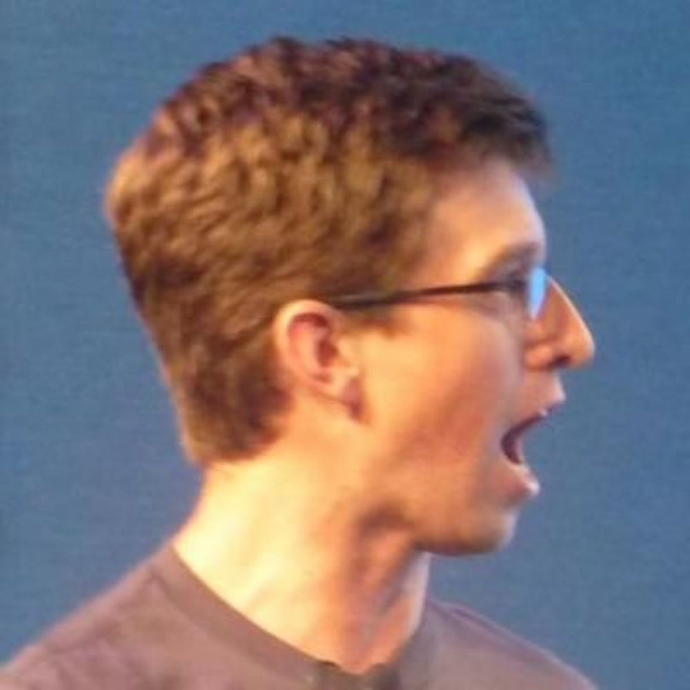

Heya! I'm Bryan Cantrill,
a software engineer who has spent my career at the hardware/software
interface. I am the 
[co-founder]()
and CTO of
[Oxide Computer Company](https://oxide.computer).
Prior to Oxide, I spent 
[nine years at Joyent](); prior to Joyent,
I worked for 
[fourteen years at Sun Microsystems]().

While [the writing here]() is mainly work-related, it is not
exclusively so 
(aside:
[sell the team]()!).
In addition to my writing, I have given
[many talks over the years]().
If this somehow leaves you thirsting for more, I also -- along
with my long-time co-conspirator [Adam Leventhal](https://ahl.dtrace.org/) --
host a regular podcast,
[Oxide and Friends](https://oxide-and-friends.transistor.fm/).

