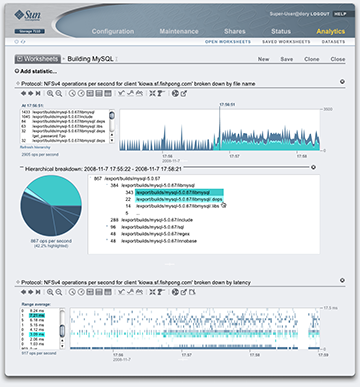

In October 2005, longtime partner-in-crime [Mike Shapiro](http://blogs.sun.com/mws) and I were taking stock. Along with [Adam Leventhal](http://blogs.sun.com/ahl), we had just finished DTrace -- and Mike had finished up another substantial body of work in [FMA](http://opensolaris.org/os/community/fm/) -- and we were beginning to wonder about what was next. As we looked at Solaris 10, we saw an incredible building block -- the best, we felt, ever made, with revolutionary technologies like ZFS, DTrace, FMA, SMF and so on. But we also saw something lacking: despite being a great foundation, the truth was that the technology _wasn't_ being used in many essential tasks in information infrastructure, from routing packets to storing blocks to making files available over the network. This last one especially grated: despite having **invented** network attached storage with NFS in 1983, and despite having the necessary components to efficiently serve files built into the system, and despite having exciting hardware like [Thumper](http://www.sun.com/servers/x64/x4500/) and despite having absolutely killer technologies like ZFS and DTrace, Sun had no share -- none -- of the NAS market.

As we reflected on why this was so -- why, despite having so many of the necessary parts Sun had not been able to put together a compelling integrated product -- we realized that part of the problem was organizational: if we wanted to go solve this problem, it was clear that we could not do it from the confines of a software organization. With this in mind, we requested a meeting with [Greg Papadopoulos](http://blogs.sun.com/Gregp/), Sun's CTO, to brainstorm. Greg quickly agreed to a meeting, and Mike and I went to his office to chat. We described the problem that we wanted to solve: integrate Sun's industry-leading components together and build on them to develop a killer NAS box -- one with differentiators only made possible by our technology. Greg listened intently as we made our pitch, and then something unexpected happened -- something that tells you a lot about Sun: Greg rose from his chair and exclaimed, "let's do it!" Mike and I were caught a bit flat-footed; we had expected a much safer, more traditional answer -- like "let's commission a task force!" or something -- and instead here was Greg jumping out in front: "Get me a presentation that gives some of the detail of what you want to do, and I'll talk to Jonathan and Scott about it!"

Back in the hallway, Mike and I looked at each other, still somewhat in disbelief that Greg had been not just receptive, but so explicitly encouraging. Mike said to me exactly what I was thinking: "Well, I guess we're doing this!"

With that, Mike and I pulled into a nearby conference room, and we sat down with a new focus. This was neither academic exercise nor idle chatter over drinks -- we now needed to think about what specifically separated our building blocks from a NAS appliance. With that, we started writing missing technologies on the whiteboard, which soon became crowded with things like browser-based management, clustering, e-mail alerts, reports, integrated fault management, seamless upgrades and rollbacks, and so on. When the whiteboard was full and we took a look at all of it, the light went on: virtually none of this stuff was specific to NAS. At that instant, we realized that the NAS problem was but one example of a larger problem, and that the infrastructure to build fully-integrated, special-purpose systems was _itself_ general-purpose across those special purposes!

We had a clear picture of what we wanted to go do. We put our thoughts into a presentation that we entitled "A Problem, An Opportunity & An Idea" (of which I have made available [a redacted version](http://dtrace.org/resources/bmc/fishy-redacted.pdf)) and sent that to Greg. A week or so later, we had a con-call with Greg, in which he gave us the news from Scott and Jonathan: they bought it. It was time to put together a business plan, build our team and get going.

Now Mike and I went into overdrive. First, we needed a name. I don't know how long he had been thinking about it, or how it struck him, but Mike said that he was thinking of the name "Fishworks", it not only being a distinct name that paid homage to a storied engineering tradition (and with an oblique Simpsons reference to boot), but one that also embedded an apt acronym: "FISH", Mike explained, stood for "fully-integrated software and hardware" -- which is exactly what we wanted to go build. I agreed that it captured us perfectly -- and Fishworks was born.

We built our team -- including Adam, [Eric](http://blogs.sun.com/eschrock) and [Keith](http://blogs.sun.com/wesolows) -- and on February 15, 2006, we got to work. Over the next two and a half years, we went through many changes: our team grew to include [Brendan](http://blogs.sun.com/brendan), [Greg](http://blogs.sun.com/greg), [Cindi](http://blogs.sun.com/cindi), [Bill](http://blogs.sun.com/wdp), [Dave](http://blogs.sun.com/dap) and [Todd](http://blogs.sun.com/tmp); our technological vision expanded as we saw the exciting potential of [the flash revolution](http://blogs.sun.com/ahl/entry/flash_hybrid_pools_and_future); and our product scope was broadened through hundreds of conversations with potential customers. But through these changes our fundamental vision remained intact: that we would build a general purpose appliance kit -- and that we would use it to build a world-beating NAS appliance. Today, at long last, the first harvest from this long labor is available: the [Sun Storage 7110](http://www.sun.com/storage/disk_systems/unified_storage/7110/), [Sun Storage 7210](http://www.sun.com/storage/disk_systems/unified_storage/7210/) and [Sun Storage 7410](http://www.sun.com/storage/disk_systems/unified_storage/7410/).

It is deeply satisfying to see these products come to market, especially because the differentiators that we so boldly predicted to Sun's executives so long ago have not only come to fruition, they are also delivering on our promise to set the product apart in the marketplace. Of these, I am especially proud of our DTrace-based _appliance analytics_. With analytics, we sought to harness the great power of DTrace: its ability to answer _ad hoc_ questions that are phrased in terms of the system's _abstractions_ instead of its _implementation_. We saw an acute need for this in network storage, where even market-leading products cannot answer the most basic of questions: "what am I serving and to whom?" The key, of course, was to capture the strength of DTrace _visually_ -- and the trick was to give up enough of the arbitrary latitude of DTrace to allow for strictly visual interactions without giving up so much as to unnecessarily limit the power of the facility.

I believe that the result -- which you can sample [in this screenshot](images/analytics_screenshot_full.png) -- does more than simply strike the balance: we have come up with ways to visualize and interact with data that actually function as a force multiplier for the underlying instrumentation technology. So not only does analytics bring the power of DTrace to a much broader spectrum of technologists, it also -- thanks to the wonders of [the visual cortex](http://en.wikipedia.org/wiki/Visual_cortex) -- has much greater utility than just DTrace alone. (Or, as one hardened veteran of command line interfaces put it to me, "this is the one GUI that I actually _want_ to use!")

There is much to describe about analytics, and for those interested in a reasonably detailed guided tour of the facility, check out this [presentation on analytics](http://dtrace.org/resources/bmc/cec_analytics.pdf) that I will be giving later this week at Sun's Customer Engineering Conference in Las Vegas. While the screenshots in that presentation are illustrative, the power of analytics (like DTrace before it) is in actually seeing it for yourself, in real-time. You can get a flavor for that [in this video](http://link.brightcove.com/services/link/bcpid1683878780/bctid1906937239), in which Mike and I demonstrate and discuss analytics. (That video is part of a larger [Inside Fishworks](http://wikis.sun.com/display/BluePrints/Sun%20Storage%207000%20Management%20Software) series that takes you through many elements of our team and the product.) While the video is great, it still can't compare to seeing analytics in your own environment -- and for that, you should contact your Sun rep or Sun reseller and arrange to test drive an appliance yourself. Or if you're the impatient show-me-now kind, download this [VMware image](https://cds.sun.com/is-bin/INTERSHOP.enfinity/WFS/CDS-CDS_SMI-Site/en_US/-/USD/ViewProductDetail-Start?ProductRef=SunStorageSim-1.0-OTH-G-F@CDS-CDS_SMI) that contains a full, working Sun Storage 7000 appliance, with 16 (virtual) disks. Configure the virtual appliance, add a few shares, access them via CIFS, WebDAV, NFS, whatever, and bust out some analytics!
