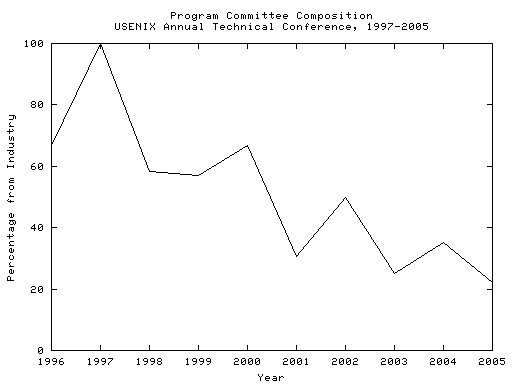

[Werner Vogels](http://www.cs.cornell.edu/vogels/default.htm), a member of the [USENIX '04 Program Committee](http://www.usenix.org/events/usenix04/organizers.html), has written [very thoughtful responses](https://web.archive.org/web/20081006150917/https://www.allthingsdistributed.com/historical/archives/000482.html) to some of [my observations](http://dtrace.org/blogs/bmc/2004/07/06/whither-usenix/). And it's clear that Werner and I see the same problem: there is insufficient industrial/academic cooperation in computer science systems research -- and the lack of cooperation is to the detriment of both groups.

That said, it's clear that there are some different perspectives as to how to address the problem. A common sentiment that I'm seeing in the comments is that it is up to industry to keep USENIX relevant (in Werner's words, "industry will need to be more pro-active in making researchers aware of what the problems are that they need to solve"). I don't entirely agree; in my opinion, the responsibility for keeping USENIX relevant doesn't lie exclusively with industry -- and it doesn't lie exclusively with academia, either. Rather, the responsibility lies with USENIX itself, for it is [the mission of USENIX](http://www.usenix.org/about/) to encourage research with a "practical bias." As such, it is up to USENIX to assemble a Program Committee that will reflect this mission, and it is up to _both_ academia and industry to participate as requested. This means that USENIX cannot simply wait for volunteers from industry to materialize -- USENIX must _seek out_ people in industry who understand both the academic and the industrial sides of systems research, and they must _convince_ these people to work on a Program Committee. Now, I know that this _has_ happened in the past -- and frankly I thought that the USENIX '04 Program Committee was a step in the right direction: where [USENIX '03](http://www.usenix.org/events/usenix03/) had four (of sixteen) members from industry, USENIX '04 had six (of seventeen). But unfortunately, [USENIX '05](http://www.usenix.org/events/usenix05/cfp/organizers.html) seems to be a marked decline in industry participation, even from USENIX '03: the number from industry has dropped back to four (of eighteen). Worse, all four are from industry labs; where both USENIX '03 and USENIX '04 had at least one product-oriented member from industry, USENIX '05 has none.

Examining these three years of USENIX brings up an interesting question: what has the Program Committee composition looked like over time? That is, is the situation getting better or worse vis a vis industry participation? To answer this question, I looked at the Program Committee composition for the last nine years.

The results are perhaps well-known, but they were shocking to me:

To me, this trend should be deeply disconcerting: an organization that has dedicated itself to research with a "practical bias" is clearly losing that bias in its flagship conference.

So what to do? First, we need some recognition from the USENIX side that this is a serious issue, and that it requires substantial corrective action. I believe that [the USENIX Board](http://www.usenix.org/about/board.html) should charter a committee that consists of academia and industry (both labs _and_ product groups) in roughly equal measure. This committee should hash out some of the misconceptions that each group has of the other, clearly define the problems, develop some long-term (measurable) goals, and make some concrete short- and medium-term recommendations. The deliverable of the committee should be a report summarizing their findings and recommendations -- recommendations that the Board should consider but is obviously free to ignore.

The situation is serious, and there is much work to be done to rectify it -- but I am heartened by the amount of thought that Werner has put into this issue. If we can find more like him from both industry and academia, we _can_ get the "practical bias" back into USENIX.
